# AccessSwitch

AccessSwitch is an Android accessibility app for users with motor impairments. It provides a scanning-based interface that can be controlled with external switches, a phone used as a large touch switch, or both at the same time.

The app targets both Android phones and Chromebooks running Android apps.

## Screenshots

Screenshots are generated automatically from the UI via Roborazzi screenshot tests. Run the
[Update Screenshots](../../actions/workflows/update-screenshots.yml) workflow to (re)generate them.

### Mobile

| Home | Settings | Scanning Overlay |
|------|----------|-----------------|
| 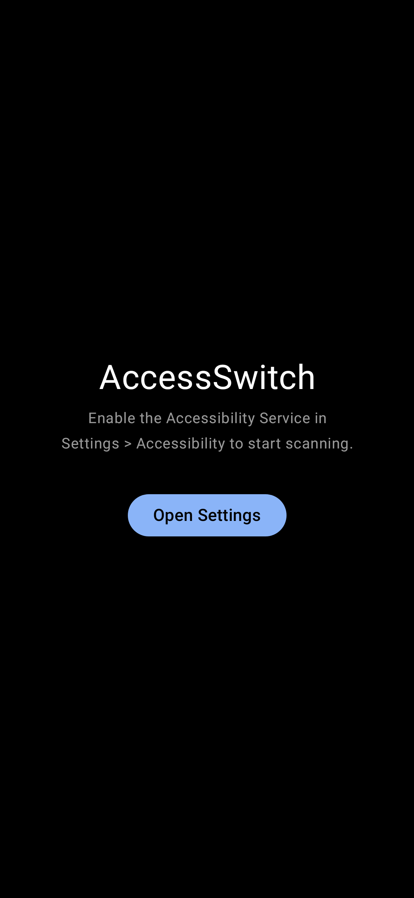 | 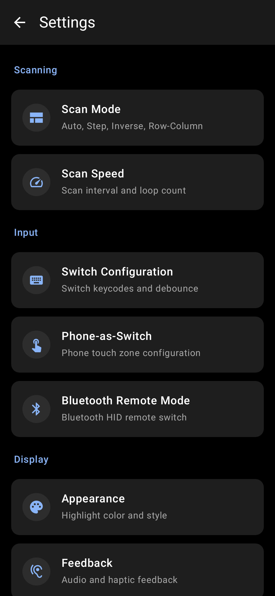 | 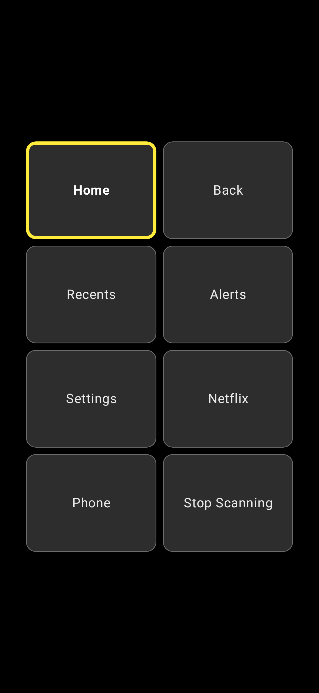 |

| Phone Switch (Split) | Phone Switch (Full) | Scan Mode |
|----------------------|---------------------|-----------|
|  |  | 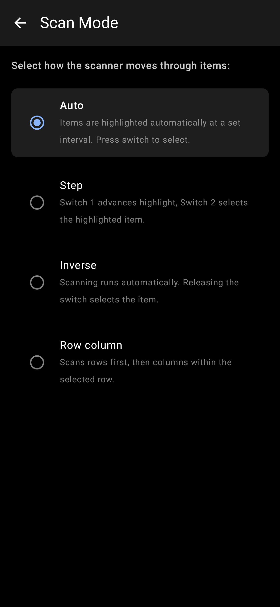 |

| Scan Speed | Appearance | Feedback | PIN Lock |
|------------|------------|----------|---------|
| 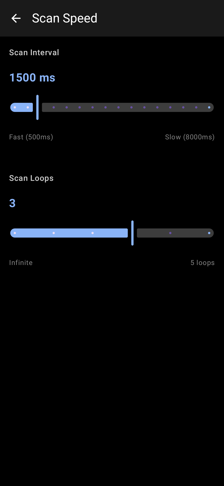 | 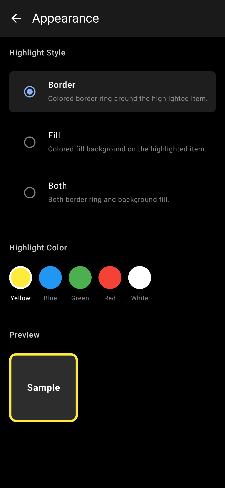 | 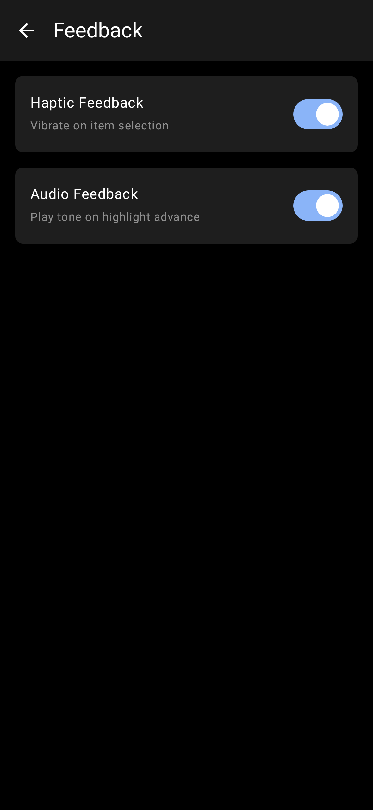 |  |

### Chromebook

| Home | Settings | Scanning Overlay |
|------|----------|-----------------|
| 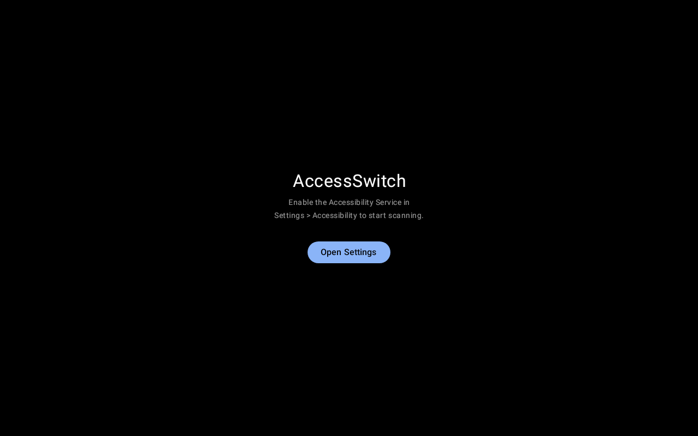 | 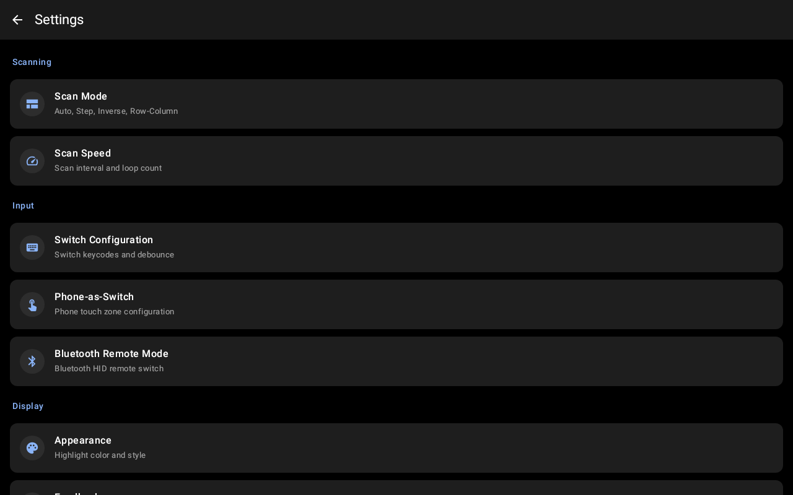 | 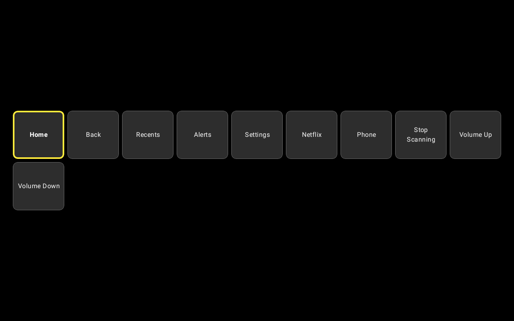 |

| Phone Switch (Split) | Scan Mode | Appearance |
|----------------------|-----------|------------|
|  | 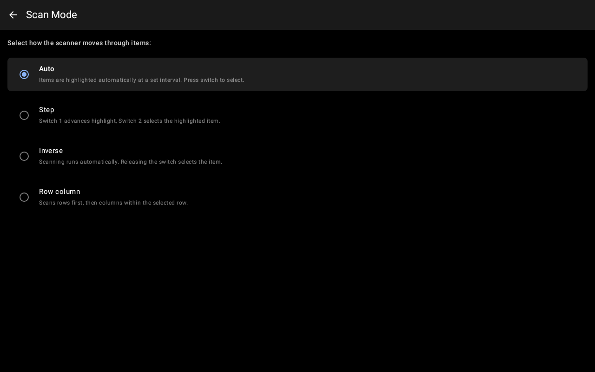 | 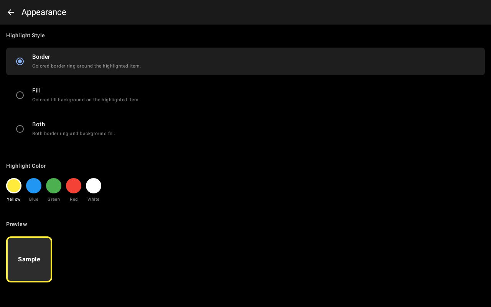 |

## Features

- Scanning overlay driven by one-switch or two-switch input
- External switch input via Bluetooth or USB HID keyboard-style devices
- Phone-as-switch local mode with large touch zones
- Phone-as-switch remote mode via `BluetoothHidDevice`
- Android OS navigation through `AccessibilityService` global actions
- Phone calling controls for contacts, incoming calls, and in-call actions
- Netflix browse and playback controls with mode detection and manual fallback
- Settings UI for scan timing, key mapping, appearance, feedback, PIN lock, and phone switch modes
- Graceful degradation for unsupported features like telephony or Bluetooth HID

## Status

The codebase currently includes the core app implementation through the polish and hardening phase:

- Project scaffolding and Android app setup
- Scanning engine and switch input hub
- Compose overlay and feedback handling
- Navigation and settings screens
- Phone calling module
- Netflix control module
- Phone-as-switch local and Bluetooth HID remote support
- CI and release GitHub Actions workflows

Remaining work is primarily release preparation, manual device validation, and Play Store distribution.

## Tech Stack

- Kotlin
- Android SDK 35
- Jetpack Compose
- Hilt
- DataStore
- AccessibilityService
- StateFlow / Coroutines
- JUnit + MockK + Turbine

## Project Structure

```text
app/src/main/java/com/accessswitch/
  accessibility/   Accessibility service integration
  di/              Hilt module definitions
  input/           Switch event intake and Bluetooth HID service
  nav/             Android global navigation actions
  netflix/         Netflix browse/playback control
  overlay/         Scanning overlay UI and menu wiring
  phone/           Contacts, call state, and call controls
  scanning/        Scanning engine and scan item models
  settings/        App settings, repository, and settings UI
  switchscreen/    Phone-as-switch touch UI
  util/            Device capability and crash reporting helpers

docs/
  prd.md           Product requirements
  tdd.md           Technical design
  plan.md          Phase-by-phase implementation plan
```

## Requirements

- JDK 17
- Android SDK command-line tools or Android Studio
- Android SDK Platform 35
- Android Build Tools 35.0.0

## Local Setup

1. Install JDK 17.
2. Install Android SDK packages for API 35 and build tools 35.0.0.
3. Ensure `ANDROID_HOME` or `ANDROID_SDK_ROOT` points to your SDK.
4. Make the Gradle wrapper executable:

```bash
chmod +x gradlew
```

## Build And Test

Run the same main checks used in CI:

```bash
./gradlew lintDebug testDebugUnitTest assembleDebug
```

Build release artifacts locally:

```bash
./gradlew assembleRelease bundleRelease
```

Debug APK output:

```text
app/build/outputs/apk/debug/
```

Release outputs:

```text
app/build/outputs/apk/release/
app/build/outputs/bundle/release/
```

## Release Signing

`app/build.gradle.kts` supports optional release signing through Gradle properties:

- `ACCESSSWITCH_SIGNING_STORE_FILE`
- `ACCESSSWITCH_SIGNING_STORE_PASSWORD`
- `ACCESSSWITCH_SIGNING_KEY_ALIAS`
- `ACCESSSWITCH_SIGNING_KEY_PASSWORD`

Example:

```bash
./gradlew assembleRelease bundleRelease \
  -PACCESSSWITCH_SIGNING_STORE_FILE=/path/to/release.keystore \
  -PACCESSSWITCH_SIGNING_STORE_PASSWORD=secret \
  -PACCESSSWITCH_SIGNING_KEY_ALIAS=accessswitch \
  -PACCESSSWITCH_SIGNING_KEY_PASSWORD=secret
```

If those properties are not provided, the release build falls back to the default unsigned behavior.

## GitHub Actions

### Build Workflow

`.github/workflows/android-build.yml`

- Runs on every push and pull request
- Sets up JDK 17 and Android SDK 35
- Accepts Android SDK licenses
- Runs lint, unit tests, and debug assembly
- Uploads the debug APK and reports as workflow artifacts

### Release Workflow

`.github/workflows/android-release.yml`

- Runs on tag pushes matching `v*` and on manual dispatch
- Builds release APK and AAB artifacts
- Uploads release artifacts to the workflow run
- Publishes a GitHub Release automatically for tag builds

Optional GitHub secrets for signed releases:

- `ANDROID_KEYSTORE_BASE64`
- `ANDROID_KEYSTORE_PASSWORD`
- `ANDROID_KEY_ALIAS`
- `ANDROID_KEY_PASSWORD`

## Device Notes

- Development currently uses keyboard keys to simulate switch input
- External switches are expected to appear as keyboard-style HID devices
- Chromebook support depends on Android accessibility behavior inside ARC++
- Bluetooth HID remote mode requires Android 9+ and device/OEM support for `BluetoothHidDevice`

## Documentation

- `docs/prd.md` for product scope and user requirements
- `docs/tdd.md` for architecture and implementation details
- `docs/plan.md` for the phased delivery plan

## License

No license has been added yet.
